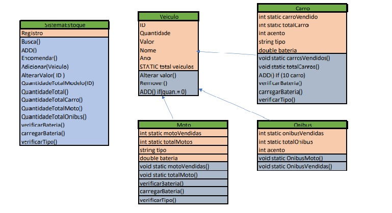

# Sistema-de-Estoque
 

Este projeto está sendo desenvolvido e será feito na linguagem Java, onde foi desenvolvido um sistema que gerencia um estoque de uma empresa de automóveis. É um projeto que está sendo desenvolvido usando modelo de software baseado em orientação de objetos.
## Descrição do problema 
 
Uma empresa de vendas de automóveis, necessita de um sistema que gerencie seus veículos em estoque. Através dele, o usuário poderá adicionar um novo automóvel, realizar buscas no estoque, alterar o valor, emitir relatórios dos veículos vendidos e em estoque, entre outros. 

A arquitetura do sistema é voltada a orientação de objetos. O sistema é composto pelas seguintes classes: Veículo, Carro, Moto, Ônibus, SistemaEstoque e Testes. A classe que vai gerenciar as classes será a “SistemaEstoque”. Já as outras classes possuirão os atributos e métodos mencionados no parágrafo abaixo.  

Todo veículo deve possuir um ID, que contém a identificação do veículo, a quantidade, modelo, ano e valor. Também, todo veículo pode adicionar, remover e alterar o valor. Entretanto, o ônibus, por possuir muito espaço, poderá ter somente 5 ônibus no estoque, independente do modelo (ou seja, quando possuir 5 ônibus no estoque, não poderá adicionar mais). Já o carro, pode possuir somente 10. A moto não importa a quantidade, posso adicionar quantas vezes quiser. Tanto carro, quanto moto e ônibus podem ver a quantidade que foram vendidos e o total deles. Se a quantidade de veículos for igual a 0, deve-se remover da lista. Tanto o ônibus quanto o carro devem conter uma variável armazenando a quantidade de assentos presentes. Também, o carro e a moto poderão ter tipos diferentes, pode existir tanto moto e carro elétricos quanto moto e carro movidos à gasolina. Quando um desses veículos for adicionado ao estoque, o funcionário deve verificar se são elétricos ou movido a gasolina. Se são elétricos, o funcionário deve verificar se a bateria dele está cheia. Se não estiver cheia, deve-se carregar a bateria e informar que a bateria está sendo carregada. Se estiver cheia, deve-se informar que a bateria já está cheia. Se for movido a gasolina, não acontecerá nada.  

O sistema de estoque deve conter uma estrutura de armazenamento de veículos, com chave (ID) e valor. Também, pode-se fazer uma busca para verificar se possui veículo em estoque, pode encomendar mais veículos, adicionando na estrutura de armazenamento e pode-se alterar o valor do veículo. Também, o sistema pode gerar um relatório contendo a quantidade total de veículos no estoque (independentemente da quantidade por modelos), quantidade total modelos de veículos e a quantidade total de carros, motos e ônibus.   

