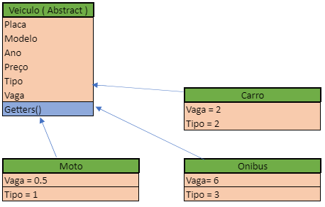
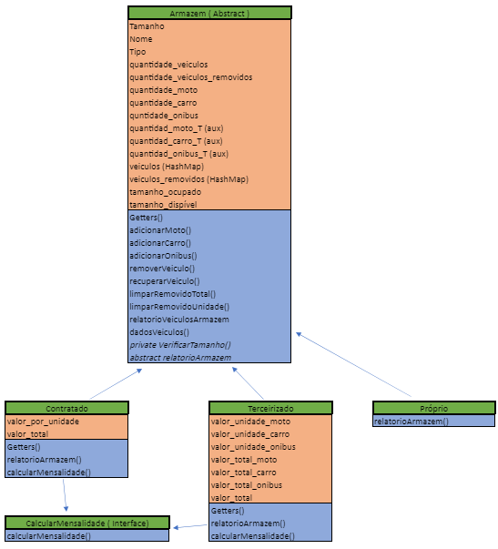
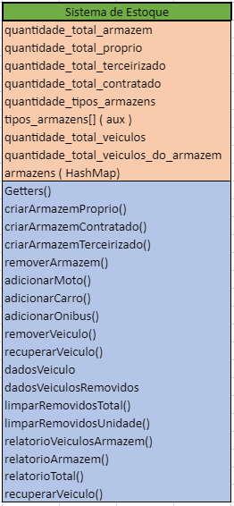

# Sistema-de-Estoque
 

## Descrição do Sistema

  Desenvolvemos um sistema de gerenciamento de estoque de automóveis. Através dele, o usuário poderá gerenciar os veículos contidos em seus armazéns e também poderá solicitar relatórios que auxiliaram no gerenciamento e tomada de decisões da empresa. 

  Nosso sistema conta com algumas entidades: Armazéns: Próprio, Contratado e Terceirizado; Veículos: Carro, Moto e Ônibus; e o Sistema de Estoque. 

  O sistema trabalha com 3 tipos de armazéns, conforme listado acima. Os armazéns possuem um identificador único, que é o nome (key). Através desses armazéns, poderá ser realizado o gerenciamento dos veículos.  Entretanto, existe armazéns onde há custo em armazenar o veículo. O armazém próprio não tem custo. Já os armazéns contratados e terceirizados têm custo. O armazém contratado se baseia no tamanho do armazém que tu vais contratar, ou seja, a cada 1 tamanho de espaço é cobrado uma taxa. Já o armazém terceirizado se baseia no tipo de veículo que irá ser armazenado, ou seja, a moto, carro e ônibus possui um valor por unidade. 
  Também, o sistema pode possuir 3 tipos de veículos, conforme listado acima (Carro, Moto e Ônibus). Os veículos possuem um identificar único, que é a placa (key). 

## Conclusão
  O sistema foi desenvolvido utilizando conceitos orientada a objetos (atributos e métodos). Também, em nosso sistema, foi aplicado conceitos de herança, polimorfismo, classes abstratas, interface, key-value, hashmap, entre outros. Além disso, foi realizado o tratamento de exceções. O sistema possui uma interface interativa para o usuário, que é representado pela classe menu. 

  As tabelas a seguir representa as classes com seus respectivos métodos e atributos. Através da tabela, observa-se os conceitos citados a cima. 

  
Representa a classe veículo e suas subclasses com seus respectivos métodos e atributos 

  
Representa a classe armazém e suas subclasses com seus respectivos métodos e atributos 

  
Representa a classe Sistema de Estoque que gerencia todas as classes contidas no sistema com seus respectivos métodos e atributos. 

Tabela 1: Representa as classes com seus respectivos métodos e atributos

